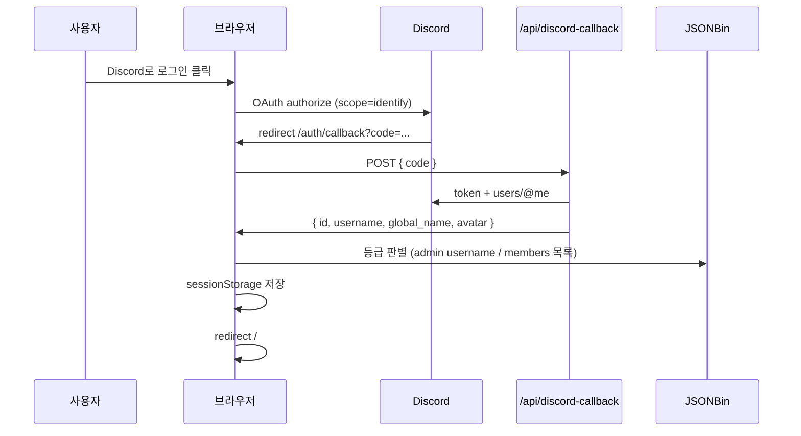

# 🛌 아빠안잔다 — OTT 편성표 & 커뮤니티 웹앱

> **매일 밤 20:00 ~ 02:00, 가족·연인·친구가 함께 볼 OTT 프로그램을 고정 편성과 실시간 추천으로 제공하는 React SPA**

[](https://react.dev/)
[](https://www.typescriptlang.org/)
[](https://vite.dev/)
[](https://vercel.com/)
[](LICENSE)

**저장소:** [github.com/zyansuh/dadnosleep](https://github.com/zyansuh/dadnosleep)

---

## 목차

1. [프로젝트 소개](#1-프로젝트-소개)
2. [아키텍처 개요](#2-아키텍처-개요)
3. [주요 기능](#3-주요-기능)
4. [사용자 등급 & Discord 인증](#4-사용자-등급--discord-인증)
5. [기술 스택](#5-기술-스택)
6. [폴더 구조](#6-폴더-구조)
7. [설치 및 실행](#7-설치-및-실행)
8. [환경변수 (전체 목록)](#8-환경변수-전체-목록)
9. [Discord OAuth 설정](#9-discord-oauth-설정)
10. [JSONBin 설정](#10-jsonbin-설정)
11. [Vercel 배포](#11-vercel-배포)
12. [기능 상세 가이드](#12-기능-상세-가이드)
13. [데이터 저장 구조](#13-데이터-저장-구조)
14. [관리자 가이드](#14-관리자-가이드)
15. [문제 해결 (FAQ)](#15-문제-해결-faq)
16. [CSS · UI](#16-css--ui)
17. [기여 방법](#17-기여-방법)
18. [라이선스](#18-라이선스)

---

## 1. 프로젝트 소개

**아빠안잔다**는 심야 방송 채널용 **주간 OTT 편성표**와 **시청자 커뮤니티**를 한곳에서 제공하는 단일 페이지 애플리케이션(SPA)입니다.

| 영역 | 한 줄 요약 |
|------|-----------|
| **편성표** | 7일×3슬롯 + VIP 회원 행 — 항상 `BASE_SCHED` 기본 표시, 관리자 **공개** 시 published 반영 (JSONBin) |
| **건의함** | `/suggestions` 목록·상세, JSONBin 저장, 관리자 **답변**·처리 상태 변경 |
| **추천 API** | TMDB·YouTube 인기작, OTT 통합·랜덤 목록 드로어 |
| **커뮤니티** | 후기(1,500P)·지인 초대(2,000P), 포인트 랭킹, JSONBin 동기화 |
| **인증** | Discord OAuth2, guest / member / admin 3등급 |
| **관리** | `/admin` — 회원 명단·탈퇴, 기간별 포인트, **건의함 관리**, 테스트 초기화 |
| **반응형** | 1024 / 768 / 640 / 420px — 홈·커뮤니티·관리자·모달 전 화면 대응 |
| **UI 색상** | 모바일·데스크톱 동일 `--bg-card` 단색 카드 (블러/반투명 보정 없음) |
| **코드 구조** | 도메인별 `store/` · `table|cell|modals/` · `pages/home/` — 기존 import는 re-export로 유지 |

### 운영 시간대 (편성표 UI 기준)

- **방송 슬롯:** 20:00 · 22:00 · 00:00 (새벽 0~5시는 당일 방송으로 보정)
- **고정 편성 예:** 목·금 22:00 (나는 솔로 / 이혼숙려캠프 등 — `constants/schedule.ts`에서 변경)

---

## 2. 아키텍처 개요

### 라우트

| 경로 | 설명 | 인증 |
|------|------|------|
| `/` | 메인 (`HomePage` — `pages/home/*` 조합, 홈·커뮤니티 탭) | 없음 |
| `/auth/callback` | Discord OAuth code 처리 | 없음 |
| `/admin` | 관리 대시보드 · 테스트 초기화 | Discord **admin** 로그인 |
| `/admin/members` | 회원 명단 (로그인 전 사전 등록 가능) | 동일 |
| `/admin/points` | 기간별 포인트 집계 | 동일 |
| `/suggestions` | 건의함 목록 (제목·작성자·작성일·처리상태) | 없음 |
| `/suggestions/:id` | 건의 상세 · 관리자 답변(`replies[]`) 표시 | 없음 (답변 작성은 admin) |
| `/admin/suggestions` | 건의함 관리 (목록·상태 변경) | Discord **admin** 로그인 |

### 데이터 저장 (편성표·건의함 · JSONBin 직접)

편성표·건의함은 **커뮤니티 후기와 동일하게** 브라우저가 `VITE_JSONBIN_*`로 JSONBin v3 API를 직접 호출합니다. Vercel 서버 API를 거치지 않습니다.

| 도메인 | 클라이언트 | JSONBin 필드 | 관리자 UI |
|--------|-----------|--------------|-----------|
| 편성표 | `scheduleApi.ts` → `scheduleBin.ts` | `schedule` (draft / published / isPublished) | Discord **admin** 로그인 시 편집·공개 |
| 건의함 | `suggestionApi.ts` → `suggestionBin.ts` | `suggestions[]` · `replies[]` | 상세 페이지 답변 등록 · `/admin/suggestions` 상태 변경 (admin) |

### 서버 API (Discord 로그인만)

| 메서드 | 경로 | 설명 |
|--------|------|------|
| POST | `/api/discord-callback` | OAuth code → Discord 프로필 반환 (`client_secret` 보호) |

로컬: `vite.config.ts` → `server/discord/viteMiddleware.ts`. 프로덕션: `api/discord-callback.js`.

> `api/schedule-*`, `api/suggestions-*` 파일은 레거시이며 **앱은 사용하지 않습니다**. 편성·건의는 위 JSONBin 직접 호출만 사용합니다.

### 요청 흐름 (Discord 로그인)



### 저장소 역할 분담

| 저장소 | 용도 | 만료 |
|--------|------|------|
| **sessionStorage** | Discord 로그인 세션, role, nickname | 탭 닫으면 삭제 |
| **localStorage** | 후기·포인트 fallback, 회원 캐시 | 브라우저별 유지 |
| **JSONBin** | 후기·포인트·회원·**편성표·건의함** (클라우드 동기화) | 영구 (Bin 유지 시) |
| **Vercel Serverless** | Discord `client_secret` 처리만 | 요청 단위 |

---

## 3. 주요 기능

### 📅 편성표

| 기능 | 설명 | 권한 |
|------|------|------|
| 주간 그리드 | 월~일 × 20:00/22:00/00:00 | 전체 공개 |
| 기본 편성 | 미공개·API 오류 시 `constants/schedule.ts`의 `BASE_SCHED` (목 22:00 나는 솔로, 금 22:00 이혼숙려캠프 등) | 전체 |
| 공개 편성 | 관리자가 **편성표 공개** 후 `schedule.published` 스냅샷 표시 | 전체 |
| VIP 회원 행 | `type: member` 셀 | member / admin |
| 고정 편성 | `type: fixed` — 지정·해제 | admin |
| 수기 편집 | 제목·링크만 변경 (고정 여부 별도) | admin |
| 랜덤 편성 | TMDB 한국어 작품 → **미리보기 모달**에서 선택 적용 (비관리자는 화면 미리보기만, admin은 draft 저장) | 전체 |
| 초기화 | 고정 편성만 남기고 나머지 빈 셀 | admin (확인 모달) |
| 셀 편집 모드 | 셀 클릭 수정 | admin |
| LIVE | 오늘 요일·현재 슬롯 강조 | 전체 |

편성 데이터는 JSONBin `schedule` 필드에 **ISO 주차(`week`)** 와 함께 저장됩니다. JSONBin 로드 실패 시 화면은 `BASE_SCHED`로 폴백합니다 (일반 사용자에게는 오류 배너를 숨김).

### 📺 API 추천

| 카드 | 데이터 소스 |
|------|-------------|
| 넷플릭스 TOP 10 | TMDB (provider Netflix) |
| OTT 통합 인기작 | TMDB 다중 플랫폼 |
| 랜덤 편성 생성 | TMDB 한국어 + `recommend.ts` |
| 유튜브 인기 | YouTube Data API v3 |

**MediaDrawer** (`components/home/media/MediaDrawer.tsx`): OTT 통합·랜덤 추천 결과를 슬라이드 패널로 표시합니다. **ApiCard**는 동일 `home/media/`에 있습니다.

### 💬 커뮤니티

| 기능 | 설명 |
|------|------|
| 후기 작성 | 프로그램명·별점(1~5)·닉네임·내용 |
| 지인 초대 신고 | **내 닉네임** + **초대한 지인 닉네임** 입력 → 1건당 **2,000P** (포인트는 내 닉네임 기준) |
| 포인트 | 후기 1,500P + 지인 초대 2,000P (자동 합산) |
| 랭킹 | 메인(`HomeRanking` TOP 5) · 커뮤니티(`PointRanking` TOP 10) |
| 건의함 링크 | 커뮤니티 랭킹 아래 → `/suggestions` (`CommunitySuggestionLink`) |
| 수정·삭제 | 본인 닉네임(`dadnosleep-my-nickname`) 또는 **admin** |
| JSONBin | 원격 저장 실패 시 localStorage + 토스트 「오프라인 모드로 저장됩니다」 |
| 마이그레이션 | 예전 `dadnosleep-reviews-v1` → JSONBin 1회 병합 |

### 🔐 인증 · 프로필

| 기능 | 설명 |
|------|------|
| Discord 로그인 | `#5865F2` 버튼, `identify` 스코프 |
| 프로필 메뉴 | 아바타 + 표시 이름, 드롭다운 |
| 닉네임 변경 | **member** — 2~20자, 한글·영문·숫자·`_` |
| 로그아웃 | `sessionStorage` 전체 삭제 |

### 🛠 관리자 (메인 + `/admin`)

| 기능 | 위치 |
|------|------|
| 편성표 수정·초기화·셀 편집 | 메인 (`admin` 로그인 시) |
| 후기 타인 글 수정·삭제 | 커뮤니티 |
| 회원 명단 | `/admin/members` — 추가·닉 수정·**VIP 지정/해제**·필터(전체/로그인함/로그인 전/VIP) |
| 회원 탈퇴 | `/admin/members` — 명단 삭제 + 해당인 **후기·지인초대·포인트 전부 삭제** |
| 기간별 포인트 | `/admin/points` — 합산/후기/초대 탭, 지인초대 신고 내역 표 |
| 테스트 초기화 | `/admin` — **포인트만** / 후기만 / 지인초대만 / 전체 (회원 명단 유지) |
| 푸터 「관리자」 | 비밀번호 또는 Discord admin → `/admin` |

---

## 4. 사용자 등급 & Discord 인증

### 등급 정의

| 등급 | 조건 | VIP 편성 | 편성/후기 관리 | `/admin` |
|------|------|:--------:|:--------------:|:--------:|
| **guest** | 비로그인 | ❌ | ❌ | ❌ |
| **guest** | Discord 로그인했으나 **명단에 Discord ID 없음** | ❌ | ❌ | ❌ |
| **member** | JSONBin `members[]`에 **discordId** 등록 (동호회 회원) | ❌* | ❌ | ❌ |
| **member (VIP)** | 위 + `isVip: true` (관리자 지정) | ✅ | ❌ | ❌ |
| **admin** | Discord **username**이 `ADMIN_USERS`에 포함 | ✅ | ✅ | ✅ |

관리자 username 목록 (`src/constants/adminUsers.ts`):

```ts
export const ADMIN_USERS = ['1000hyehyang1', 'sweet__rain'];
```

> admin은 username 기준입니다. 회원 whitelist는 **Discord ID(숫자 snowflake)** 기준입니다.  
> \* 명단에만 있고 VIP가 아닌 회원은 로그인·커뮤니티는 가능하나 **회원 전용 편성 행**은 잠깁니다. 기존 명단에 `isVip` 필드가 없으면 **VIP로 간주**합니다.

### 표시 이름 우선순위

```
nickname (사이트·JSONBin) → globalName (Discord) → username
```

### sessionStorage 키 (탭 닫으면 만료)

| 키 | 예시 | 설명 |
|----|------|------|
| `isLoggedIn` | `true` | Discord 세션 여부 |
| `discordId` | snowflake | Discord 사용자 ID |
| `username` | `user#1234` | Discord username |
| `globalName` | `표시이름` | Discord global name |
| `nickname` | `혜향` | 사이트 표시명 |
| `avatar` | hash | Discord 아바타 hash |
| `role` | `guest` \| `member` \| `admin` | 등급 |
| `isVip` | `true` \| `false` | VIP 편성·왕관 표시 (member·admin) |
| `isAdmin` | `true` \| `false` | `/admin`·관리 UI용 |

푸터 비밀번호 인증 시 `isAdmin`만 `true`로 올라갈 수 있으며, `role`은 guest일 수 있습니다. (편성 관리는 `isAdmin` 기준)

### VIP 잠금 UI

| 상태 | 화면 |
|------|------|
| 비로그인 guest | 🔒 + 「로그인」 버튼 |
| 로그인 guest (명단 없음) | 동호회 가입 문의 안내 |
| member (비-VIP) | 「VIP로 지정된 동호회 회원만…」 |
| member (VIP) / admin | 프로그램 제목·링크 표시 |

후기·포인트 랭킹·프로필: VIP 회원 닉네임 옆 **👑** (후기 작성 시 `isVip` 저장).

---

## 5. 기술 스택

| 구분 | 기술 | 버전(대략) | 비고 |
|------|------|------------|------|
| UI | React | 19 | 함수 컴포넌트 + Hooks |
| 언어 | TypeScript | 6 | `tsc -b` 빌드 |
| 번들러 | Vite | 8 | `loadEnv`로 dev API env 주입 |
| 라우팅 | react-router-dom | 7 | BrowserRouter |
| 아이콘 | lucide-react | 1.x | |
| 스타일 | CSS 모듈식 분리 | — | `src/styles/*.css` |
| OTT 데이터 | TMDB API v3 | — | `VITE_TMDB_*` |
| 영상 | YouTube Data API v3 | — | `VITE_YOUTUBE_API_KEY` |
| 클라우드 KV | JSONBin.io | v3 | 후기·회원 |
| 인증 서버 | Vercel Serverless | — | `api/discord-callback.js` |
| (선택) 이메일 회원 | JWT + JSONBin | jose, bcryptjs | `api/auth/*`, dev 미들웨어 |
| 배포 | Vercel | — | `vercel.json` SPA rewrite |

**상태 관리:** Redux/Zustand 없음 — React Context (`DiscordAuthContext`, `AdminGateContext`, `ToastContext`) + 커스텀 Hooks.

**품질:** `npm run lint` (ESLint + React 19 Hooks 규칙) · `npm run build` (`tsc -b` + Vite). effect 본문 동기 `setState`·render 중 ref 갱신은 피하고, 필요 시 `hooks/shared/useLatestRef`를 사용합니다.

---

## 6. 폴더 구조

코드는 **도메인별 폴더**로 나눕니다. CSS는 `src/styles/`, 비즈니스 로직은 `utils/*/store/`, UI 상태는 `hooks/`에 둡니다. 리팩터 후에도 `communityStore.ts` · `membersStore.ts` · `ScheduleTable.tsx` 등 **기존 import 경로**는 루트 re-export 파일로 유지합니다.

```
dadnosleep/
├── api/                              # Vercel Serverless (Discord OAuth만 사용)
│   ├── discord-callback.js           # 프로덕션 OAuth 콜백
│   └── schedule-*.js · suggestions-*.js  # 레거시 (앱 미사용)
│
├── server/                           # 로컬 dev API 미들웨어
│
├── src/
│   ├── App.tsx · main.tsx            # 라우터 · ToastProvider
│   │
│   ├── pages/
│   │   ├── home/                     # HomeMainView, HomeCommunityView, HomeCtaBanner …
│   │   ├── HomePage.tsx
│   │   ├── AuthCallbackPage.tsx
│   │   └── admin/
│   │       ├── AdminDashboardPage.tsx   # 링크 + 테스트 초기화
│   │       ├── AdminMembersPage.tsx
│   │       └── AdminPointsPage.tsx      # 기간별 포인트
│   │
│   ├── components/                   # UI만 (상태·저장 로직 없음)
│   │   ├── layout/                   # AppHeader, MobileNav, HomeOverlays
│   │   ├── home/
│   │   │   ├── media/                # ApiCard, MediaDrawer
│   │   │   ├── hero/                 # HeroIntro, HeroSchedulePanel
│   │   │   ├── HeroSection, ApiSection, InfoSection
│   │   ├── auth/                     # ProfileMenu, DiscordLoginButton, PrivateRoute …
│   │   ├── modals/                   # ConfirmModal
│   │   ├── ui/                       # Field, VipCrown
│   │   ├── suggestion/               # SuggestionBoard, SuggestionModal
│   │   ├── footer/                   # SiteFooter
│   │   ├── schedule/
│   │   │   ├── table/                # ScheduleTable, Desktop, Mobile
│   │   │   ├── cell/                 # CellInner, scheduleSlot
│   │   │   ├── modals/               # EditCellModal, ScheduleEditModal
│   │   │   └── ScheduleTable.tsx 등  # re-export
│   │   ├── community/                # CommunityPage(조합), PageHeader, PromoSection, ReviewSection, RankingAside …
│   │   ├── admin/
│   │   │   ├── feedback/             # AdminAlert, AdminFeedbackBanner
│   │   │   ├── members/              # MemberAddForm, MemberTable …
│   │   │   ├── test/                 # AdminTestToolsPanel, AdminTestReset*
│   │   │   ├── points/               # PointPeriod*, FriendInviteLog
│   │   │   └── AdminLayout.tsx
│   │   └── HeroSection.tsx 등        # 호환용 re-export → 하위 폴더
│   │
│   ├── hooks/
│   │   ├── shared/                   # useClock, useApiCards, useLatestRef, useClickOutside
│   │   ├── schedule/
│   │   │   ├── useScheduleCore.ts    # 셀·memberRow·persist
│   │   │   ├── useScheduleRandom.ts  # TMDB 랜덤·피커
│   │   │   ├── useScheduleLoader.ts  # published/draft 원격 로드
│   │   │   ├── useSchedulePublish.ts # 공개·비공개 API
│   │   │   ├── useScheduleRandom.ts  # 랜덤 추천 피커
│   │   │   ├── useScheduleUi.ts      # 편집 모드·초기화 모달 플래그
│   │   │   ├── useScheduleEditForm.ts
│   │   │   └── useSchedule.ts        # Core·Loader·Random·Publish·Ui 조합
│   │   ├── suggestion/               # useSuggestionForm
│   │   ├── community/                # useCommunityLoad, useCommunityMutations, useReviewForm
│   │   ├── members/                  # useMemberVipKeys
│   │   ├── admin/
│   │   │   ├── members/              # useMembersListQuery, useMembersMutations …
│   │   │   ├── points/               # usePointReportQuery, usePointReportDerived …
│   │   │   ├── suggestions/          # useAdminSuggestions
│   │   │   ├── useAdminFeedback.ts · useAdminTestReset.ts
│   │   │   └── useAdminMembers.ts    # re-export
│   │   └── useClock.ts 등            # re-export → hooks/shared
│   │
│   ├── utils/                        # 순수 함수·API·저장소
│   │   ├── community/
│   │   │   ├── store/                # local, merge, load, persist, adminReset, purgeMember …
│   │   │   ├── communityStore.ts     # re-export (기존 import 경로 유지)
│   │   │   └── pointCalc, pointPeriod, friendInvite
│   │   ├── members/
│   │   │   ├── store/                # cache, normalize, load, save, mutations, withdraw …
│   │   │   ├── membersStore.ts       # re-export
│   │   │   └── memberIdentity, memberVip, memberDisplay
│   │   ├── schedule/
│   │   │   ├── store/                # constants, weekKey, types (원격 저장 — localStorage 제거)
│   │   │   ├── scheduleApi.ts        # 편성표 facade (JSONBin 직접)
│   │   │   ├── scheduleBin.ts        # schedule JSONBin read/write
│   │   │   ├── scheduleStorage.ts    # weekKey 등 re-export
│   │   │   ├── scheduleTime.ts · recommend.ts · scheduleCell · cellDisplay
│   │   ├── suggestion/               # suggestionApi · suggestionBin · formatSuggestionDate
│   │   ├── http/                     # parseJsonResponse (Discord API 등 비-JSON 안전 처리)
│   │   ├── admin/                    # adminApiToken (레거시 JWT, 선택)
│   │   ├── messages/                 # toUserFacingError (화면용 오류 문구)
│   │   ├── jsonbin/
│   │   │   ├── fetch.ts · put.ts · communityPut.ts · membersBin.ts · extractMembers.ts
│   │   │   ├── jsonbinEnv.ts · jsonbinRecord.ts (re-export)
│   │   ├── auth/                     # discordOAuth, discordSession, processDiscordLogin
│   │   └── nickname.ts · format.ts · api.ts (+ scheduleTime/recommend shim)
│   │
│   ├── constants/                    # 라벨·설정 표 (UI/훅에서 import)
│   │   ├── schedule.ts · points.ts · suggestion.ts · adminPointPresets.ts …
│   │
│   ├── context/                      # DiscordAuth, AdminGate, Toast
│   ├── types/                        # Cell, community, member, role, suggestion, adminAlert
│   │
│   ├── styles/                       # CSS만 — App.css → @import (컴포넌트에 import 금지)
│   │   ├── variables.css · header.css · hero.css · schedule.css · suggestions.css · community.css
│   │   ├── admin/                    # layout, shared, alerts, members, suggestions, points/, dashboard
│   │   ├── responsive.css · responsive-admin.css
│   │   └── admin/responsive-test-tools.css
│   │
│   └── legacy/                       # 미사용 Ott/Yt JSX, 이메일 AuthContext
│
├── public/
├── vercel.json · vite.config.ts · .env.example
└── package.json
```

### 계층 분리 원칙

| 계층 | 역할 | 금지 |
|------|------|------|
| **pages** | 라우트·조합 | 비즈니스 로직 직접 구현 |
| **components** | 표시·이벤트 전달 | `fetch`, JSONBin, session 직접 호출 |
| **hooks** | 상태·effect·저장 호출 | JSX 반환 (Provider 제외) |
| **utils** | 순수 로직·API·store | React import |
| **constants** | 문구·버튼 설정·enum | 부수 효과 |
| **styles** | 클래스·미디어쿼리 | TS/JS import |

관리자 **테스트 초기화** 예: `constants/adminTestReset.ts`(문구) → `hooks/admin/useAdminTestReset.ts`(실행) → `components/admin/test/*`(UI) → `styles/admin/test-tools.css`.

관리자 **알림(alert)** 예: `hooks/admin/useAdminFeedback.ts`(상태) → `components/admin/feedback/AdminAlert.tsx`(표시) → `styles/admin/alerts.css`.

관리자 **회원 명단** 훅 예: `useMembersListQuery`(조회) · `useMembersFilters`(필터) · `useMembersMutations`(추가·VIP·탈퇴) · `useMembersEdit`(닉 수정) → `useAdminMembers.ts`에서 조합.

**커뮤니티 저장소** (`utils/community/store/`): `local.ts`(localStorage) · `merge.ts` · `remoteFetch`/`remoteSave` · `load.ts`/`persist.ts` · `adminReset.ts` · `purgeMember.ts`. 진입점은 `communityStore.ts` re-export.

**회원 명단 저장소** (`utils/members/store/`): `cache.ts` · `normalize.ts` · `load.ts`/`save.ts` · `mutations.ts` · `withdraw.ts`. 진입점은 `membersStore.ts` re-export.

**편성표 훅** (`hooks/schedule/`): `useScheduleLoader`(원격 로드) · `useScheduleCore`(셀·draft 저장) · `useScheduleRandom` · `useSchedulePublish` · `useScheduleUi` → `useSchedule.ts`에서 조합.

**건의함** (`hooks/suggestion/` · `utils/suggestion/` · `pages/suggestions/`): `useSuggestionForm` → JSONBin 등록 · `SuggestionDetailPage` → 관리자 답변(`addSuggestionReply`) · `useAdminSuggestions` → 상태 변경.

**커뮤니티 훅** (`hooks/community/`): `useCommunityLoad`(조회·storage 동기화) · `useCommunityMutations`(persist·CRUD) → `useCommunity.ts`에서 조합.

**커뮤니티 UI** (`components/community/`): `CommunityPageHeader` · `CommunityPromoSection` · `CommunityRankingAside` · `CommunityReviewSection` → `CommunityPage.tsx`에서 조합.

**JSONBin** (`utils/jsonbin/`): `fetch` · `put` · `communityPut` · `membersBin` · `extractMembers` — `jsonbinRecord.ts`는 re-export.

**메인 페이지** (`pages/` + `pages/home/`):

| 파일 | 역할 |
|------|------|
| `HomePage.tsx` | `AppHeader` · 탭 전환 · `HomeOverlays` |
| `home/HomeMainView.tsx` | 홈 탭 — Hero · API · Info · Ranking · CTA · Footer |
| `home/HomeCommunityView.tsx` | 커뮤니티 탭 — `CommunityPage` 래퍼 |
| `home/HomeCtaBanner.tsx` | 하단 「편성표 보러가기」 배너 |
| `home/useHomePageEffects.ts` | 편집 모드·커뮤니티 refresh effect |

**re-export 진입점** (새 코드는 하위 폴더, 기존 import는 유지):

| 경로 | 실제 구현 |
|------|-----------|
| `utils/community/communityStore.ts` | `utils/community/store/*` |
| `utils/members/membersStore.ts` | `utils/members/store/*` |
| `utils/schedule/scheduleStorage.ts` | `utils/schedule/store/*` |
| `utils/jsonbin/jsonbinRecord.ts` | `utils/jsonbin/fetch.ts` 등 |
| `components/schedule/ScheduleTable.tsx` | `components/schedule/table/*` |
| `components/HeroSection.tsx` | `components/home/HeroSection.tsx` → `home/hero/*` |
| `components/ApiCard.tsx` · `MediaDrawer.tsx` | `components/home/media/*` |
| `hooks/useClock.ts` 등 | `hooks/shared/*` |

### 분리 완료 (참고)

| 영역 | 구조 |
|------|------|
| `components/community/` | Header · Promo · RankingAside · ReviewSection → `CommunityPage` |
| `hooks/community/` | `useCommunityLoad` · `useCommunityMutations` → `useCommunity` |
| `components/layout/overlays/` | `HomeSuggestionOverlays` · `HomeScheduleOverlays` · `HomeMediaOverlays` |

### import 규칙 (예시)

| 계층 | 예시 |
|------|------|
| 페이지 → 훅 | `import { useAdminMembers } from '../hooks/admin/useAdminMembers'` |
| 페이지 → UI | `import { MemberTable } from '../components/admin/members/MemberTable'` |
| 훅 → 유틸 | `import { loadMembersBin } from '../utils/members/membersStore'` |
| UI → 상수 | `import { ADMIN_RESET_ACTIONS } from '../../constants/adminTestReset'` |
| 오류 문구 | `import { toUserFacingError } from '../../utils/messages/userMessages'` |
| 스타일 | `admin-page.css`에서만 `@import` — 컴포넌트 `.tsx`에 CSS import 없음 |

---

## 7. 설치 및 실행

### 사전 요구사항

- **Node.js** `v20.19.0` 이상 (권장 `v22+`)
- **npm** `v10` 이상
- (배포) Vercel 계정, (데이터) JSONBin, (로그인) Discord Application

### 클론 · 설치 · 실행

```bash
git clone https://github.com/zyansuh/dadnosleep.git
cd dadnosleep
npm install
cp .env.example .env.local
# .env.local 편집 — 8~10절 참고
npm run dev
```

브라우저: **http://localhost:5173**

### npm 스크립트

| 명령어 | 설명 |
|--------|------|
| `npm run dev` | Vite 개발 서버 + `/api/auth/*`, `/api/discord-callback` 미들웨어 |
| `npm run build` | TypeScript 검사 + `dist/` 프로덕션 빌드 |
| `npm run preview` | 빌드 결과 로컬 서빙 |
| `npm run lint` | ESLint |

### Windows 참고

Rolldown 네이티브 바인딩 오류 시:

```bash
npm install @rolldown/binding-win32-x64-msvc
```

(`optionalDependencies` — Linux/Vercel CI에서는 자동 스킵)

### 로컬 vs 프로덕션 Redirect URI

| 환경 | `VITE_DISCORD_REDIRECT_URI` / `DISCORD_REDIRECT_URI` |
|------|------------------------------------------------------|
| 로컬 개발 | `http://localhost:5173/auth/callback` |
| Vercel | `https://<your-domain>.vercel.app/auth/callback` |

로컬에서 **프로덕션 URL**을 Redirect로 쓰면, 로그인 콜백이 Vercel 서버로 가므로 **Vercel 환경변수**가 적용됩니다. 로컬 `.env.local`만 수정해도 콜백 단계에서는 반영되지 않을 수 있습니다.

---

## 8. 환경변수 (전체 목록)

```bash
cp .env.example .env.local
```

`.env.local`은 Git에 올라가지 않습니다. **API 키·시크릿은 절대 커밋하지 마세요.**

### 클라이언트 (`VITE_*` — 빌드 시 번들에 포함됨)

| 변수 | 필수 | 설명 |
|------|:----:|------|
| `VITE_TMDB_API_KEY` | ○ | TMDB API v3 키 |
| `VITE_TMDB_READ_TOKEN` | 권장 | TMDB Bearer 토큰 |
| `VITE_YOUTUBE_API_KEY` | ○ | YouTube Data API v3 |
| `VITE_JSONBIN_BIN_ID` | ○ | 후기·포인트 Bin ID |
| `VITE_JSONBIN_ACCESS_KEY` | ○ | JSONBin Access Key (**따옴표 없이**) |
| `VITE_JSONBIN_BIN_MEMBERS` | △ | 회원 전용 Bin (비우면 아래 Bin에 `members` 필드로 통합) |
| `VITE_DISCORD_CLIENT_ID` | ○ | Discord Application Client ID |
| `VITE_DISCORD_REDIRECT_URI` | ○ | OAuth Redirect (로컬/프로덕션 각각) |
| `VITE_ADMIN_DISCORD_USERS` | △ | Discord 관리자 @username (쉼표 구분, 비우면 `constants/adminUsers.ts` 기본값) |

> **`VITE_DISCORD_CLIENT_SECRET` 사용 금지** — 브라우저에 노출됩니다. 반드시 `DISCORD_CLIENT_SECRET`(서버 전용)을 쓰세요.

### 서버 전용 (Vercel Environment Variables + 로컬 `.env.local`)

| 변수 | 필수 | 설명 |
|------|:----:|------|
| `DISCORD_CLIENT_ID` | ○ | Client ID (`VITE_`와 동일) |
| `DISCORD_CLIENT_SECRET` | ○ | Client Secret (**Git·VITE_ 금지**) |
| `DISCORD_REDIRECT_URI` | ○ | Redirect URI (`VITE_`와 동일) |
| `JWT_SECRET` | △ | (선택) Discord `adminToken` JWT 서명 — 레거시 API용 |
| `ADMIN_DISCORD_USERS` | △ | 서버 측 관리자 username (쉼표 구분, 비우면 코드 기본값) |
| `JSONBIN_USERS_BIN_ID` | △ | (선택) 이메일 회원 Bin |
| `JSONBIN_ACCESS_KEY` | △ | (선택) 레거시 서버 API용 — **편성·건의는 `VITE_JSONBIN_*`만 사용** |
| `ADMIN_EMAILS` | △ | (선택) 이메일 admin 목록 |

편성표·건의함·커뮤니티는 **`VITE_JSONBIN_BIN_ID` + `VITE_JSONBIN_ACCESS_KEY`** 만 있으면 동작합니다. Discord **admin** 판별은 `VITE_ADMIN_DISCORD_USERS` 또는 `constants/adminUsers.ts`입니다.

로컬 개발 시 `vite.config.ts`의 `loadEnv`가 `.env.local`의 `DISCORD_*`를 `process.env`에 주입해 dev API가 동작합니다.

### `.env.local` 최소 예시 (로컬)

```env
# TMDB / YouTube
VITE_TMDB_API_KEY=your_tmdb_key
VITE_TMDB_READ_TOKEN=your_bearer_token
VITE_YOUTUBE_API_KEY=your_youtube_key

# JSONBin (후기 + 회원 통합 Bin 사용 시 MEMBERS 비움)
VITE_JSONBIN_BIN_ID=your_bin_id
VITE_JSONBIN_ACCESS_KEY=your_access_key_without_quotes

# Discord — 로컬
VITE_DISCORD_CLIENT_ID=your_client_id
VITE_DISCORD_REDIRECT_URI=http://localhost:5173/auth/callback
DISCORD_CLIENT_ID=your_client_id
DISCORD_CLIENT_SECRET=your_client_secret
DISCORD_REDIRECT_URI=http://localhost:5173/auth/callback

# Discord 관리자 @username (쉼표 구분, 선택)
VITE_ADMIN_DISCORD_USERS=your_discord_username,another_admin
ADMIN_DISCORD_USERS=your_discord_username,another_admin

# (선택) 레거시 adminToken JWT
# JWT_SECRET=your_random_32_char_or_longer_secret
```

---

## 9. Discord OAuth 설정

### 1) Discord Application

1. [Discord Developer Portal](https://discord.com/developers/applications) → **New Application**
2. **OAuth2 → General**
   - Client ID 복사 → `VITE_DISCORD_CLIENT_ID`, `DISCORD_CLIENT_ID`
   - Client Secret **Reset/복사** → `DISCORD_CLIENT_SECRET` only
3. **OAuth2 → Redirects** — 사용하는 URL **전부** 등록:
   - `http://localhost:5173/auth/callback`
   - `https://dadnosleep.vercel.app/auth/callback` (실제 도메인)

### 2) 스코프

앱은 `identify` 스코프만 사용합니다 (프로필·아바타).

### 3) 서버 엔드포인트

| 환경 | 경로 | 구현 |
|------|------|------|
| 프로덕션 | `POST /api/discord-callback` | `api/discord-callback.js` |
| 로컬 | 동일 | `server/discord/viteMiddleware.ts` |

요청 본문: `{ "code": "<oauth_code>" }`  
응답: `{ id, username, global_name, avatar }`

---

## 10. JSONBin 설정

### Bin 하나로 쓰기 (권장 · 간단)

`VITE_JSONBIN_BIN_MEMBERS`를 **비워 두면** 후기 Bin(`VITE_JSONBIN_BIN_ID`) 하나에 아래 형태로 저장합니다.

```json
{
  "reviews": [],
  "points": [],
  "members": []
}
```

- 후기 저장 시 `members` 배열은 **유지**됩니다.
- 회원 명단 저장 시 `reviews` / `points`는 **유지**됩니다.

### Bin 분리 (선택)

회원만 별도 Bin을 쓰려면:

1. JSONBin에서 새 Bin 생성, 초기값 `{ "members": [] }`
2. `VITE_JSONBIN_BIN_MEMBERS=<새 Bin ID>` 설정

### Access Key

1. [jsonbin.io](https://jsonbin.io) → **API Keys** → Access Key 생성
2. `.env` / Vercel에 `VITE_JSONBIN_ACCESS_KEY` 입력
3. 값에 **따옴표를 넣지 않음** (`"$2a$10$..."` 형태는 401 원인이 될 수 있음)
4. Bin 소유 계정과 Key가 일치해야 함

### 회원 레코드 스키마

```json
{
  "discordId": "123456789012345678",
  "username": "discord_username",
  "globalName": "Discord 표시 이름",
  "nickname": "사이트에서 보이는 이름",
  "avatar": "discord_avatar_hash",
  "role": "member",
  "joinedAt": "2026-06-02"
}
```

로그인 시 `avatar`, `globalName`, `username`은 Discord 최신값으로 자동 갱신됩니다.

---

## 11. Vercel 배포

### 체크리스트

1. GitHub `zyansuh/dadnosleep` 연결 → Import
2. **Settings → Environment Variables** — Production(및 Preview)에 등록:

| 변수 | Production |
|------|:----------:|
| `VITE_TMDB_API_KEY` | ✅ |
| `VITE_TMDB_READ_TOKEN` | ✅ |
| `VITE_YOUTUBE_API_KEY` | ✅ |
| `VITE_JSONBIN_BIN_ID` | ✅ |
| `VITE_JSONBIN_ACCESS_KEY` | ✅ |
| `VITE_DISCORD_CLIENT_ID` | ✅ |
| `VITE_DISCORD_REDIRECT_URI` | ✅ 프로덕션 URL |
| `DISCORD_CLIENT_ID` | ✅ |
| `DISCORD_CLIENT_SECRET` | ✅ |
| `DISCORD_REDIRECT_URI` | ✅ 프로덕션 URL |
| `VITE_ADMIN_DISCORD_USERS` | △ (비우면 `adminUsers.ts` 기본값) |
| `ADMIN_DISCORD_USERS` | △ |
| `VITE_JSONBIN_BIN_MEMBERS` | △ (비워도 됨) |

3. Discord Portal Redirects에 프로덕션 콜백 URL 추가
4. **Deployments → Redeploy** (env 변경 후 필수)

### `vercel.json`

SPA 라우팅(`index.html`)과 레거시 API rewrite만 정의합니다. 편성·건의는 JSONBin 직접 호출이므로 rewrite에 의존하지 않습니다.

```json
{
  "rewrites": [
    { "source": "/((?!api/).*)", "destination": "/index.html" }
  ]
}
```

### 빌드 실패 (`ERESOLVE` / `esbuild`)

Vite 8은 `esbuild@^0.27` 이상을 요구합니다. 이 프로젝트는 빌드에 `esbuild`를 쓰지 않으므로 **루트 `package.json`에서 `esbuild` devDependency를 제거**했습니다. Vercel에서 `npm install`이 실패하면 최신 `main`을 Redeploy하세요.

---

## 12. 기능 상세 가이드

### 12-1. 편성표 (시청자)

1. 메인 → **오늘 편성표 보기** 또는 스크롤 — 관리자가 아직 공개하지 않아도 **기본 편성표**가 표시됩니다
2. 셀 클릭 시 링크가 있으면 OTT/YouTube/TMDB 이동
3. **랜덤 편성 생성하기** → 목록에서 작품 선택 → 적용 (본인 화면에서만 미리보기, 새로고침 시 원래 편성으로 복귀)

### 12-2. 편성표 (관리자)

1. Discord **admin**으로 로그인 (편집 UI는 admin 전용)
2. **편성표 수정하기** — 요일별 일괄 편집 (draft → JSONBin)
3. **셀 편집 모드** ON → 셀 클릭, 고정 지정/해제(🔓)
4. **랜덤 편성 생성하기** — 선택 적용 시 draft에 저장 (시청자는 **편성표 공개** 후에만 반영)
5. **편성표 공개** — 시청자에게 `published` 반영 / **공개 취소** — 시청자는 다시 기본 편성표 표시
6. **초기화** — 고정만 남김 (확인 모달)

### 12-2b. 건의함

1. 헤더 **건의함** 또는 커뮤니티 탭 랭킹 아래 **건의함** 카드 → `/suggestions` 목록
2. **건의하기** → 프로그램·시간대·내용 제출
3. 항목 클릭 → `/suggestions/:id` 상세 (건의 내용·관리자 답변 확인)
4. 관리자 (Discord **admin** 로그인):
   - 상세 하단 **관리자 답변** → 내용 입력 · **답변 등록** (JSONBin `replies[]` 저장, 상태 **답변 완료**로 변경 — **종료** 건은 상태 유지)
   - **처리 상태** 버튼 또는 `/admin/suggestions` 드롭다운으로 상태 변경

건의·답변 데이터는 JSONBin에 저장되며 **코드 배포·Redeploy만으로는 삭제되지 않습니다** (동일 `VITE_JSONBIN_BIN_ID` 유지 시).

### 12-3. 커뮤니티

1. 헤더 **커뮤니티** → 후기 목록·포인트 랭킹
2. **후기 작성하기** → 1,500P
3. **지인 초대 완료 신고** → 내 닉네임·초대한 지인 닉네임 입력 → 2,000P
4. 본인 글: 연필·휴지통 / admin: 모든 글 관리

### 12-4. 닉네임 변경 (member)

1. 헤더 프로필(아바타·이름) 클릭
2. **닉네임 변경** → 검증 후 저장
3. JSONBin `members[].nickname` + `sessionStorage.nickname` 동시 반영

### 12-5. 관리자 페이지

1. Discord **관리자 계정**으로 로그인 (README §14 「관리자 추가」 참고)
2. 푸터 **관리자** 링크 또는 모바일 메뉴 **관리자 페이지** → `/admin`
3. 미로그인·비관리자는 로그인 안내 모달 표시

### 12-6. 회원 명단·탈퇴 (관리자)

1. `/admin/members` (또는 대시보드 **회원 명단 · 탈퇴 처리**)
2. **회원 추가** — Discord 이름·닉네임 입력 (로그인 불필요)
3. **로그인함** 탭 — 이미 로그인한 회원 확인
4. 나간 회원 → **탈퇴** → 확인 (명단 + 후기 + 지인초대 + 포인트 삭제)
5. **기간별 포인트**(`/admin/points`)에서 랭킹·신고 내역 반영 확인

---

## 13. 데이터 저장 구조

### JSONBin 통합 레코드 (기본)

`VITE_JSONBIN_BIN_ID` 하나에 저장되는 전체 형태:

```json
{
  "reviews": [
    {
      "id": "1717200000000-abc12",
      "nickname": "시청자",
      "programTitle": "나는 솔로",
      "rating": 5,
      "content": "재미있어요!",
      "createdAt": "2026-06-01T12:00:00.000Z"
    }
  ],
  "friendInvites": [
    {
      "id": "inv-...",
      "nickname": "시청자",
      "inviteeNickname": "친구닉",
      "createdAt": "2026-06-01T14:00:00.000Z"
    }
  ],
  "points": [
    { "nickname": "시청자", "points": 5500, "reviewCount": 1, "inviteCount": 2 }
  ],
  "pointsCleared": false,
  "members": [
    {
      "discordId": "123456789012345678",
      "username": "discord_user",
      "globalName": "표시이름",
      "nickname": "닉네임",
      "avatar": "hash",
      "role": "member",
      "joinedAt": "2026-06-02"
    }
  ],
  "schedule": {
    "draft": { "week": "2026-W23", "data": [], "memberRow": [] },
    "published": { "week": "2026-W23", "data": [], "memberRow": [] },
    "isPublished": true,
    "publishedAt": "2026-06-05T12:00:00.000Z"
  },
  "suggestions": [
    {
      "id": "1717200000000-abc12",
      "title": "프로그램명",
      "category": "예능",
      "time": "금요일 밤",
      "desc": "건의 내용",
      "nick": "닉네임",
      "createdAt": "2026-06-05T10:00:00.000Z",
      "status": "pending",
      "replies": [
        {
          "id": "1717300000000-xyz99",
          "body": "다음 주 편성에 검토해 볼게요!",
          "createdAt": "2026-06-05T14:00:00.000Z",
          "authorRole": "admin"
        }
      ]
    }
  ]
}
```

| 필드 | 설명 |
|------|------|
| `schedule.draft` | 관리자만 보는 작업 중 편성 |
| `schedule.published` | `isPublished: true` 일 때 일반 사용자에게 노출 (미공개·오류 시 클라이언트 `BASE_SCHED` 폴백) |
| `suggestions[]` | 건의함 — `status`: pending / reviewing / answered / closed |
| `suggestions[].replies[]` | 관리자 답변 (`authorRole`: `admin`) — 상세 페이지에서 등록 |
| `pointsCleared` | `true`면 후기·초대는 유지하고 랭킹 `points[]`만 0 (관리자 **포인트만 초기화**) |
| `members` | 회원 명단 — `putCommunityBinRecord`가 **members·schedule·suggestions** 보존 |

### localStorage

| 키 | 내용 | 만료 |
|----|------|------|
| `dadnosleep-members-cache-v1` | 회원 명단 마지막 스냅샷 (원격 유실·HMR 복구) | 수동 삭제 전까지 |
| `dadnosleep-points-cleared-v1` | `1` = 포인트만 초기화 플래그 (로컬) | 초기화 해제·재집계 시 삭제 |
| `dadnosleep-admin-api-token` | (레거시) Admin JWT — sessionStorage | 탭 닫으면 만료 |
| `dadnosleep-reviews-v1` | 후기 fallback / 마이그레이션 원본 | 수동 삭제 전까지 |
| `dadnosleep-points-v1` | 포인트 fallback | 동일 |
| `dadnosleep-friend-invites-v1` | 지인 초대 fallback | 동일 |
| `dadnosleep-my-nickname` | 후기 「나」 뱃지용 | — |
| `reviews_migrated` | `1` = 레거시 마이그레이션 완료 | — |

### Cell 타입 (`types/index.ts`)

| `type` | 의미 |
|--------|------|
| `fixed` | 고정 편성 |
| `ott` / `random` / `community` | 일반·추천 슬롯 |
| `member` | VIP 회원 행 |
| `empty` | 빈 슬롯 (초기화 후) |

---

## 14. 관리자 가이드

### `/admin` 접근 조건

`PrivateRoute`는 Discord **admin** 역할 로그인 시에만 통과합니다 (`DiscordAuthContext.isAdmin`).

편성표 편집·건의 상태 변경도 **클라이언트에서 admin 역할**로 UI를 제한합니다 (JSONBin Access Key는 후기·커뮤니티와 동일하게 빌드에 포함됩니다).

### 관리자 추가 방법

관리자는 Discord **@username**(로그인 식별 이름) 기준입니다. 아래 **둘 중 하나**로 추가하세요.

**방법 1 — 코드 상수 (권장·로컬 개발)**

`src/constants/adminUsers.ts` 의 `DEFAULT_ADMIN_DISCORD_USERS` 배열에 username 추가:

```ts
export const DEFAULT_ADMIN_DISCORD_USERS = [
  '1000hyehyang1',
  'sweet__rain',
  '새관리자_username',  // ← 추가
] as const;
```

서버는 `server/constants/adminUsers.ts` 의 동일 기본 목록을 사용합니다. 배포 전 **두 파일을 맞추거나** 방법 2 env를 쓰세요.

**방법 2 — 환경변수 (Vercel·재배포 없이 목록 변경 시)**

```env
VITE_ADMIN_DISCORD_USERS=username1,username2
ADMIN_DISCORD_USERS=username1,username2
```

- 클라이언트: 로그인 시 admin 역할 판별 (`processDiscordLogin` → `adminUsers.ts`)
- 서버: OAuth 콜백에서 동일 username 목록으로 admin 여부 판별 (선택 `adminToken` 발급)

**적용 확인**

1. 해당 Discord 계정으로 로그인
2. 헤더에 **관리자** 뱃지 표시
3. `/admin` 접속 · 편성표 **공개** 버튼 · 건의 상태 변경 동작

### 메뉴

| 경로 | 기능 |
|------|------|
| `/admin` | 대시보드, 링크, **포인트만/후기만/초대만/전체** 테스트 초기화 |
| `/admin/members` | 회원 명단·탈퇴(포인트 삭제 포함) |
| `/admin/points` | 기간별 포인트 집계 (후기·지인 초대 시각 기준) |
| `/admin/suggestions` | 건의함 목록·처리 상태 변경 |

### 회원 명단 (`/admin/members`)

운영자용 화면입니다. 개발 용어(JSONBin·env 등)는 화면에 노출하지 않으며, 저장이 안 될 때만 「운영 담당자에게 문의」 안내가 표시됩니다.

| 작업 | 방법 |
|------|------|
| **추가** | Discord @이름 또는 표시 이름(필수) + 사이트 닉네임(선택) → 「회원 추가」 |
| **닉네임 수정** | 닉네임 클릭 또는 「수정」→ 저장 |
| **탈퇴** | 「탈퇴」→ 확인 → 명단 삭제 + 포인트 데이터 초기화 |
| **목록 필터** | **전체** · **로그인함** (한 번이라도 로그인) · **로그인 전** (사전 등록만) |

**사전 등록:** 대상 회원이 아직 Discord 로그인을 하지 않아도 명단에 올릴 수 있습니다. 첫 로그인 시 **member** 등급이 적용됩니다.

**탈퇴 처리 (`withdrawMember` + `purgeCommunityDataForMember`):**

1. **로그인함** 탭에서 나간 회원 선택 → **탈퇴**
2. JSONBin `members[]`에서 해당 행 삭제
3. 아래 닉네임과 일치하는 커뮤니티 데이터 **전부 삭제** 후 포인트 재계산:
   - 등록 식별 이름(`username`)
   - Discord 표시 이름(`globalName`)
   - 사이트 닉네임(`nickname`)
   - 후기(`reviews[].nickname`)
   - 지인 초대 — 신고자·초대받은 지인 닉네임(`friendInvites`)
4. 재로그인 시 **guest**, VIP 편성 행 잠금

| 구분 | 탈퇴 후 |
|------|---------|
| 회원 명단 | ❌ 삭제 |
| 후기·지인 초대·랭킹 포인트 | ❌ 삭제 (해당 닉네임 매칭분) |
| 다른 회원 데이터 | ✅ 유지 |

**UI:** 데스크톱은 표, 모바일(720px↓)은 카드 목록. 입력 라벨·빈 목록 문구는 `clamp`로 화면 너비에 맞게 한 줄 표시.

### 기간별 포인트 (`/admin/points`)

**조회 탭 (3종)**

| 탭 | 설명 |
|----|------|
| **합산** | 후기·지인 초대를 **한 표**에서 동시에 표시 (건수 + 후기P + 초대P + 합산P) |
| **후기** | 후기 작성만 (1,500P/건) |
| **지인 초대** | 초대 신고만 (2,000P/건) |

**지인 초대 신고 내역** (합산·지인 초대 탭 하단): 선택 기간의 신고 목록 — 신고 시각, 내 닉네임, 초대한 지인 닉네임. 구 형식(닉네임만)은 「미기재」로 표시.

- 기간 프리셋: 오늘 · 최근 7일 · 이번 달 · 지난 달 · 전체 · 직접 지정
- **등록 회원만 보기**: 명단 기준 0P 포함 / 끄면 미등록 닉네임도 표시
- **새로고침**: JSONBin 최신 데이터 반영

합산 탭 표 예시:

| 닉네임 | 후기 건수 | 후기 P | 초대 건수 | 초대 P | 합산 |
|--------|-----------|--------|-----------|--------|------|

### 테스트 초기화 (`/admin` 대시보드)

| 버튼 | 동작 |
|------|------|
| **포인트만 초기화** | 후기·지인 초대 **유지** · 랭킹 포인트만 0 (`pointsCleared` 플래그, 새 후기/초대 시 재집계) |
| **후기만 초기화** | 후기 삭제 · 지인 초대 **유지** |
| **지인 초대만 초기화** | 지인 초대 삭제 · 후기 **유지** |
| **전체 초기화** | 후기 + 지인 초대 + 랭킹 전부 삭제 |

회원 명단은 네 경우 모두 유지됩니다.

### 회원 명단이 안 보이거나 사라질 때

- 후기·포인트를 저장할 때 **같은 JSONBin Bin**을 쓰면, 예전에는 `members` 필드가 빠지며 명단이 지워질 수 있었습니다. 지금은 `putCommunityBinRecord`가 **기존 `members`·`schedule`·`suggestions`를 유지**합니다 (관리자 테스트 초기화 포함).
- 개발 중(HMR) 새로고침 시에도 **브라우저 localStorage 캐시**(`dadnosleep-members-cache-v1`)로 마지막 명단을 복원합니다.
- 관리자 페이지를 열면 원격에 명단이 없고 캐시만 있을 때 **자동으로 Bin에 다시 씁니다**.

### 관리자 username 변경

`src/constants/adminUsers.ts` 수정 → 배포. Discord username이 정확히 일치해야 합니다.

---

## 15. 문제 해결 (FAQ)

### `DISCORD_CLIENT_SECRET is not configured`

| 확인 | 조치 |
|------|------|
| Vercel에 `DISCORD_CLIENT_SECRET` 등록 | Dashboard → Env → Redeploy |
| 로컬 `.env.local`에 동일 키 | 따옴표 없이 |
| `VITE_DISCORD_CLIENT_SECRET`만 있음 | 서버용 `DISCORD_CLIENT_SECRET` 추가 (VITE는 브라우저 노출) |
| Redirect가 프로덕션 URL | 콜백은 Vercel에서 처리 → **Vercel env** 확인 |
| dev 서버 재시작 | `npm run dev` 재실행 |

### `VITE_JSONBIN_*` / 회원 명단 미설정 경고

| 확인 | 조치 |
|------|------|
| `VITE_JSONBIN_ACCESS_KEY` + `VITE_JSONBIN_BIN_ID` | 필수 |
| `VITE_JSONBIN_BIN_MEMBERS` | 비워도 됨 (통합 Bin) |
| Access Key 따옴표 | 제거 |
| JSONBin 401 | Key 재발급, Bin 소유 확인 |

### Discord `redirect_uri` 오류

- Portal Redirects URL과 `DISCORD_REDIRECT_URI` / `VITE_DISCORD_REDIRECT_URI`가 **완전 일치** (http/https, 슬래시 포함)

### 로그인했는데 VIP가 안 보임

- `/admin/members`에 **Discord ID**(username 아님) 등록 여부
- 명단 추가 후 **로그아웃 → 재로그인**
- `role`이 `member`인지 개발자 도구 → Application → sessionStorage 확인

### 후기가 기기마다 다름

- JSONBin env 미설정 → offline localStorage만 사용
- `VITE_JSONBIN_ACCESS_KEY` 401 → Key·Bin ID 재확인

### 건의함·편성표가 비어 있거나 저장 실패

| 확인 | 조치 |
|------|------|
| Vercel에 `VITE_JSONBIN_BIN_ID` · `VITE_JSONBIN_ACCESS_KEY` | Production env 등록 후 **Redeploy** |
| JSONBin Bin에 `suggestions` · `schedule` 필드 | 없어도 첫 저장 시 자동 생성 |
| 관리자 편집·답변·상태 변경 | Discord **admin**으로 로그인 (`adminUsers.ts` 또는 env) |
| 콘솔 `api/suggestions` 500 | 무시 가능 — 앱은 JSONBin 직접 호출 (레거시 API 미사용) |

### 건의·답변이 코드 배포 후 사라졌나요?

| 원인 | 설명 |
|------|------|
| **코드 업데이트만** | 데이터는 JSONBin에 있으므로 **삭제되지 않음** |
| Bin ID·Key 변경 | 다른 Bin을 가리키면 빈 목록처럼 보임 — env 재확인 |
| JSONBin Bin 삭제 | 복구 불가 — Bin 백업 권장 |

### Vercel `npm install` / `ERESOLVE`

- 최신 `main`에 `esbuild` devDependency 제거 반영 여부 확인
- Redeploy 시 **Clear build cache** 후 재시도

---

## 16. CSS · UI

`src/App.css`는 `@import`만 담당합니다.

| 파일 | 역할 |
|------|------|
| `variables.css` | 색상·폰트·`--bg`·`--bg-gradient`·`--bg-card` |
| `header.css` | 헤더·커뮤니티/건의 버튼 |
| `hero.css` | 히어로·CTA |
| `schedule.css` | 편성표·VIP 잠금 |
| `api.css` | API 카드·그리드 |
| `modal.css` | 모달·폼 |
| `drawer.css` | MediaDrawer |
| `community.css` | 커뮤니티·랭킹 |
| `auth.css` · `discord.css` | 로그인·프로필 메뉴 |
| `admin-page.css` | 관리자 `@import` 진입점 |
| `admin/layout.css` | 셸·사이드바·푸터 관리자 링크 |
| `admin/shared.css` | 테이블·폼 공통 |
| `admin/alerts.css` | 관리자 성공·오류·경고 배너 (`AdminFeedbackBanner`) |
| `admin/members.css` | 회원 명단 폼·행 버튼 |
| `admin/dashboard.css` | 테스트 초기화 패널 |
| `admin/points.css` | 기간별 포인트 `@import` 진입점 |
| `admin/points/layout.css` · `period-toolbar.css` | 헤더·기간 필터 |
| `admin/points/view-tabs.css` | 합산/후기/초대 탭 |
| `admin/points/summary.css` · `ranking.css` | 요약 카드·랭킹 표 |
| `admin/points/invite-log.css` | 지인 초대 신고 내역 (관리자) |
| `admin/suggestions.css` | 건의함 관리·상세 관리자 UI |
| `suggestions.css` | 공개 건의함 목록·상세 페이지 |
| `toast.css` | 오프라인 토스트 |
| `layout.css` | 정보·CTA·푸터·FAB |
| `responsive.css` | 홈·API·편성표·커뮤니티·모달·드로어 (1024 / 768 / 640 / 420px) |
| `responsive-admin.css` | 관리자 사이드바·회원 카드·포인트 랭킹 카드 |

### 반응형 레이아웃 요약

| 화면 | ~768px 이하 | ~640px 이하 |
|------|-------------|-------------|
| **헤더** | 햄버거 메뉴(`MobileNav`), 데스크톱 nav 숨김 | 로고·버튼 축소 |
| **편성표** | 요일 탭 + 카드형 `sched-mobile` | 셀 패딩·폰트 축소 |
| **커뮤니티** | 랭킹·후기 1열, 프로모 카드 세로 배치 | 후기·초대 버튼 전체 너비 |
| **모달·드로어** | 하단 시트형(full width) | 폼 버튼 세로 스택 |
| **관리자** | 사이드바 → 가로 스크롤 탭, 표 → **카드 목록** | 요약 카드 1열, 초기화 버튼 full width |
| **기간별 포인트** | 합산/후기/초대 탭 세로, 랭킹 **모바일 카드** | 요약 통계 1열 |

### 모바일·데스크톱 색상 통일

예전에는 모바일(768px↓)에서 `backdrop-filter`를 끄고 카드 배경을 다른 불투명도(`rgba(30,25,50,0.95)`)로 덮어 **데스크톱과 색이 달라 보이는 문제**가 있었습니다. 현재는 아래처럼 통일합니다.

| 항목 | 값·동작 |
|------|---------|
| 페이지 배경 | `html` / `body` — `--bg` + `--bg-gradient`, `background-attachment: fixed` |
| 카드·헤더·편성표·API·모달 본문 | `--bg-card: #1e1835` **단색** (반투명+blur 없음) |
| 모달 딤 | `rgba(0,0,0,0.72)` (blur 없음) |
| 메인 타이틀 | 기본 `var(--gold)`; 그라디언트 텍스트는 `@supports` 지원 시에만 |

적용 파일: `variables.css`, `header.css`, `schedule.css`, `api.css`, `community.css`, `layout.css`, `modal.css`, `toast.css` — `responsive.css`에는 **모바일 전용 배경색 오버라이드 없음**.

기타: 터치 기기 호버 완화, 짧은 뷰포트(`max-height: 500px`) 모달 높이 조정.

### 주요 CSS 변수

```css
:root {
  --bg:        #0f0a1f;
  --bg2:       #1a1530;
  --bg-gradient: linear-gradient(180deg, #1a1530 0%, #0f0a1f 50%, #1a1530 100%);
  --bg-card:   #1e1835;   /* 헤더·편성표·카드 — 모바일/PC 동일 */
  --bg-card2:  #252042;
  --coral:     #ff6b8a;
  --gold:      #ffd57a;
  --text-sub:  #e0e0ff;
  --text-dim:  #a8a8c0;
  --border:    rgba(255, 255, 255, 0.08);
}
```

---

## 17. 기여 방법

```bash
git checkout -b feat/short-description
# 변경 · 테스트 (npm run build && npm run lint)
git commit -m "feat: 변경 요약"
git push origin feat/short-description
# GitHub에서 Pull Request
```

### Conventional Commits

| 타입 | 용도 |
|------|------|
| `feat` | 기능 |
| `fix` | 버그 |
| `docs` | README 등 |
| `refactor` | 동작 동일 리팩터 |
| `style` | CSS만 |
| `chore` | 빌드·deps |

### 코드 수정 시 참고

- **저장소 수정**은 `utils/*/store/` 하위 파일을 고치고, barrel(`communityStore.ts` 등)은 export만 추가합니다.
- **편성표 UI**는 `components/schedule/table|cell|modals/`를 우선 수정합니다.
- React 19 ESLint: `useEffect` 안에서 조건 없이 `setState` 호출 금지 → 파생 state·`key` remount·`useLatestRef` 패턴 사용.
- `context/` · `legacy/`는 Fast Refresh 규칙 예외(`eslint.config.js`에 명시).

---

## 18. 라이선스

[MIT License](LICENSE) © 2026 [zyansuh](https://github.com/zyansuh)

---

<div align="center">
  <sub>🛌 잠 못 드는 밤, 아빠안잔다와 함께하세요</sub>
</div>
