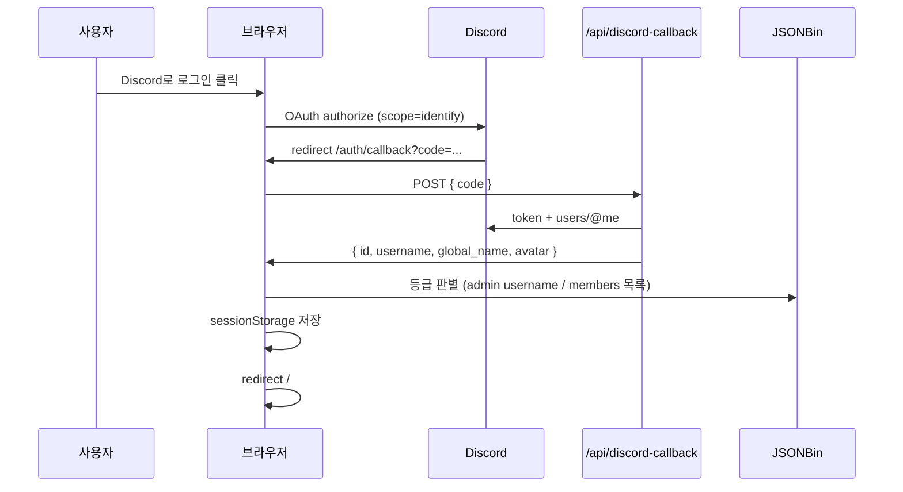

# 🛌 아빠안잔다 — OTT 편성표 & 커뮤니티 웹앱

> **매일 밤 20:00 ~ 02:00, 가족·연인·친구가 함께 볼 OTT 프로그램을 고정 편성과 실시간 추천으로 제공하는 React SPA**

[](https://react.dev/)
[](https://www.typescriptlang.org/)
[](https://vite.dev/)
[](https://vercel.com/)
[](LICENSE)

**저장소:** [github.com/zyansuh/dadnosleep](https://github.com/zyansuh/dadnosleep)

---

## 목차

1. [프로젝트 소개](#1-프로젝트-소개)
2. [아키텍처 개요](#2-아키텍처-개요)
3. [주요 기능](#3-주요-기능)
4. [사용자 등급 & Discord 인증](#4-사용자-등급--discord-인증)
5. [기술 스택](#5-기술-스택)
6. [폴더 구조](#6-폴더-구조)
7. [설치 및 실행](#7-설치-및-실행)
8. [환경변수 (전체 목록)](#8-환경변수-전체-목록)
9. [Discord OAuth 설정](#9-discord-oauth-설정)
10. [JSONBin 설정](#10-jsonbin-설정)
11. [Vercel 배포](#11-vercel-배포)
12. [기능 상세 가이드](#12-기능-상세-가이드)
13. [데이터 저장 구조](#13-데이터-저장-구조)
14. [관리자 가이드](#14-관리자-가이드)
15. [문제 해결 (FAQ)](#15-문제-해결-faq)
16. [CSS · UI](#16-css--ui)
17. [기여 방법](#17-기여-방법)
18. [라이선스](#18-라이선스)

---

## 1. 프로젝트 소개

**아빠안잔다**는 심야 방송 채널용 **주간 OTT 편성표**와 **시청자 커뮤니티**를 한곳에서 제공하는 단일 페이지 애플리케이션(SPA)입니다.

| 영역 | 한 줄 요약 |
|------|-----------|
| **편성표** | 7일×3슬롯 + VIP 회원 행, 고정·랜덤·수기 편집, localStorage 주간 저장 |
| **추천 API** | TMDB·YouTube 인기작, OTT 통합·랜덤 목록 드로어 |
| **커뮤니티** | 후기(1,500P)·지인 초대(2,000P), 포인트 랭킹, JSONBin 동기화 |
| **인증** | Discord OAuth2, guest / member / admin 3등급 |
| **관리** | `/admin` — 회원 명단, 기간별 포인트, 테스트용 데이터 초기화 |

### 운영 시간대 (편성표 UI 기준)

- **방송 슬롯:** 20:00 · 22:00 · 00:00 (새벽 0~5시는 당일 방송으로 보정)
- **고정 편성 예:** 목·금 22:00 (나는 솔로 / 이혼숙려캠프 등 — `constants/schedule.ts`에서 변경)

---

## 2. 아키텍처 개요

### 라우트

| 경로 | 설명 | 인증 |
|------|------|------|
| `/` | 메인 (`HomePage` — 홈·커뮤니티 탭) | 없음 |
| `/auth/callback` | Discord OAuth code 처리 | 없음 |
| `/admin` | 관리 대시보드 · 테스트 초기화 | 푸터 비밀번호 **또는** Discord admin |
| `/admin/members` | 회원 명단 (로그인 전 사전 등록 가능) | 동일 |
| `/admin/points` | 기간별 포인트 집계 | 동일 |

### 요청 흐름 (Discord 로그인)



### 저장소 역할 분담

| 저장소 | 용도 | 만료 |
|--------|------|------|
| **sessionStorage** | Discord 로그인 세션, role, nickname | 탭 닫으면 삭제 |
| **localStorage** | 편성표, 건의함, 후기 fallback | 브라우저별 유지 |
| **JSONBin** | 후기·포인트·회원 명단 (클라우드 동기화) | 영구 (Bin 유지 시) |
| **Vercel Serverless** | Discord `client_secret` 처리 | 요청 단위 |

---

## 3. 주요 기능

### 📅 편성표

| 기능 | 설명 | 권한 |
|------|------|------|
| 주간 그리드 | 월~일 × 20:00/22:00/00:00 | 전체 공개 |
| VIP 회원 행 | `type: member` 셀 | member / admin |
| 고정 편성 | `type: fixed` — 지정·해제 | admin |
| 수기 편집 | 제목·링크만 변경 (고정 여부 별도) | admin |
| 랜덤 편성 | TMDB 한국어 작품 → **미리보기 모달**에서 선택 적용 | 전체 |
| 초기화 | 고정 편성만 남기고 나머지 빈 셀 | admin (확인 모달) |
| 셀 편집 모드 | 셀 클릭 수정 | admin |
| LIVE | 오늘 요일·현재 슬롯 강조 | 전체 |

편성 데이터는 `dadnosleep-sched` 키에 **ISO 주차(`week`)** 와 함께 저장되며, 주가 바뀌면 `BASE_SCHED` 기준으로 초기화됩니다.

### 📺 API 추천

| 카드 | 데이터 소스 |
|------|-------------|
| 넷플릭스 TOP 10 | TMDB (provider Netflix) |
| OTT 통합 인기작 | TMDB 다중 플랫폼 |
| 랜덤 편성 생성 | TMDB 한국어 + `recommend.ts` |
| 유튜브 인기 | YouTube Data API v3 |

**MediaDrawer:** OTT 통합·랜덤 추천 결과를 슬라이드 패널로 표시합니다.

### 💬 커뮤니티

| 기능 | 설명 |
|------|------|
| 후기 작성 | 프로그램명·별점(1~5)·닉네임·내용 |
| 지인 초대 신고 | **지인 초대 완료 신고** 버튼 → 1건당 **2,000P** (`friendInvites`) |
| 포인트 | 후기 1,500P + 지인 초대 2,000P (자동 합산) |
| 랭킹 | 메인(`HomeRanking` TOP 5) · 커뮤니티(`PointRanking` TOP 10) |
| 수정·삭제 | 본인 닉네임(`dadnosleep-my-nickname`) 또는 **admin** |
| JSONBin | 원격 저장 실패 시 localStorage + 토스트 「오프라인 모드로 저장됩니다」 |
| 마이그레이션 | 예전 `dadnosleep-reviews-v1` → JSONBin 1회 병합 |

### 🔐 인증 · 프로필

| 기능 | 설명 |
|------|------|
| Discord 로그인 | `#5865F2` 버튼, `identify` 스코프 |
| 프로필 메뉴 | 아바타 + 표시 이름, 드롭다운 |
| 닉네임 변경 | **member** — 2~20자, 한글·영문·숫자·`_` |
| 로그아웃 | `sessionStorage` 전체 삭제 |

### 🛠 관리자 (메인 + `/admin`)

| 기능 | 위치 |
|------|------|
| 편성표 수정·초기화·셀 편집 | 메인 (`admin` 로그인 시) |
| 후기 타인 글 수정·삭제 | 커뮤니티 |
| 회원 명단 CRUD | `/admin/members` (대상 회원 Discord 로그인 불필요) |
| 기간별 포인트 | `/admin/points` — 오늘/7일/이번 달/직접 지정 |
| 테스트 초기화 | `/admin` — 후기만 / 지인초대만 / 전체 삭제 |
| 푸터 「관리자」 | 비밀번호 또는 Discord admin → `/admin` |

---

## 4. 사용자 등급 & Discord 인증

### 등급 정의

| 등급 | 조건 | VIP 편성 | 편성/후기 관리 | `/admin` |
|------|------|:--------:|:--------------:|:--------:|
| **guest** | 비로그인 | ❌ | ❌ | ❌ |
| **guest** | Discord 로그인했으나 **명단에 Discord ID 없음** | ❌ | ❌ | ❌ |
| **member** | JSONBin `members[]`에 **discordId** 등록 | ✅ | ❌ | ❌ |
| **admin** | Discord **username**이 `ADMIN_USERS`에 포함 | ✅ | ✅ | ✅ |

관리자 username 목록 (`src/constants/adminUsers.ts`):

```ts
export const ADMIN_USERS = ['1000hyehyang1', 'sweet__rain'];
```

> admin은 username 기준입니다. 회원 whitelist는 **Discord ID(숫자 snowflake)** 기준입니다.

### 표시 이름 우선순위

```
nickname (사이트·JSONBin) → globalName (Discord) → username
```

### sessionStorage 키 (탭 닫으면 만료)

| 키 | 예시 | 설명 |
|----|------|------|
| `isLoggedIn` | `true` | Discord 세션 여부 |
| `discordId` | snowflake | Discord 사용자 ID |
| `username` | `user#1234` | Discord username |
| `globalName` | `표시이름` | Discord global name |
| `nickname` | `혜향` | 사이트 표시명 |
| `avatar` | hash | Discord 아바타 hash |
| `role` | `guest` \| `member` \| `admin` | 등급 |
| `isAdmin` | `true` \| `false` | `/admin`·관리 UI용 |

푸터 비밀번호 인증 시 `isAdmin`만 `true`로 올라갈 수 있으며, `role`은 guest일 수 있습니다. (편성 관리는 `isAdmin` 기준)

### VIP 잠금 UI

| 상태 | 화면 |
|------|------|
| 비로그인 guest | 🔒 + 「로그인」 버튼 |
| 로그인 guest (명단 없음) | 「현재 동호회 회원만 이용 가능한 콘텐츠입니다. 가입 문의는 관리자에게 연락해주세요.」 |
| member / admin | 프로그램 제목·링크 표시 |

---

## 5. 기술 스택

| 구분 | 기술 | 버전(대략) | 비고 |
|------|------|------------|------|
| UI | React | 19 | 함수 컴포넌트 + Hooks |
| 언어 | TypeScript | 6 | `tsc -b` 빌드 |
| 번들러 | Vite | 8 | `loadEnv`로 dev API env 주입 |
| 라우팅 | react-router-dom | 7 | BrowserRouter |
| 아이콘 | lucide-react | 1.x | |
| 스타일 | CSS 모듈식 분리 | — | `src/styles/*.css` |
| OTT 데이터 | TMDB API v3 | — | `VITE_TMDB_*` |
| 영상 | YouTube Data API v3 | — | `VITE_YOUTUBE_API_KEY` |
| 클라우드 KV | JSONBin.io | v3 | 후기·회원 |
| 인증 서버 | Vercel Serverless | — | `api/discord-callback.js` |
| (선택) 이메일 회원 | JWT + JSONBin | jose, bcryptjs | `api/auth/*`, dev 미들웨어 |
| 배포 | Vercel | — | `vercel.json` SPA rewrite |

**상태 관리:** Redux/Zustand 없음 — React Context (`DiscordAuthContext`, `AdminGateContext`, `ToastContext`) + 커스텀 Hooks.

---

## 6. 폴더 구조

코드는 **도메인별 폴더**로 나눕니다. CSS는 `src/styles/`, 비즈니스 로직은 `utils/`, UI 상태는 `hooks/`에 둡니다.

```
dadnosleep/
├── api/                              # Vercel Serverless
│   ├── discord-callback.js
│   └── auth/                         # (선택) 이메일 JWT
│
├── server/                           # 로컬 dev API 미들웨어
│
├── src/
│   ├── App.tsx · main.tsx            # 라우터 · ToastProvider
│   │
│   ├── pages/
│   │   ├── HomePage.tsx
│   │   ├── AuthCallbackPage.tsx
│   │   └── admin/
│   │       ├── AdminDashboardPage.tsx   # 링크 + 테스트 초기화
│   │       ├── AdminMembersPage.tsx
│   │       └── AdminPointsPage.tsx      # 기간별 포인트
│   │
│   ├── components/
│   │   ├── layout/                   # AppHeader, MobileNav, HomeOverlays
│   │   ├── schedule/                 # ScheduleTable, EditCellModal, CellInner, scheduleSlot
│   │   ├── community/                # CommunityPage, Review*, FriendInviteModal, PointRanking
│   │   ├── admin/                    # AdminLayout, Member*, PointPeriod*, AdminTestTools
│   │   └── …                         # HeroSection, ApiSection, ConfirmModal 등
│   │
│   ├── hooks/
│   │   ├── schedule/                 # useSchedule, useScheduleEditForm
│   │   ├── community/                # useCommunity, useReviewForm
│   │   ├── admin/                    # useAdminMembers, useAdminPointReport
│   │   ├── useClock.ts · useApiCards.ts · useSuggestionForm.ts · useClickOutside.ts
│   │
│   ├── utils/
│   │   ├── community/                # communityStore, pointCalc, pointPeriod, reviewDisplay
│   │   ├── schedule/                 # scheduleStorage, scheduleCell, cellDisplay
│   │   ├── members/                  # membersStore, memberIdentity, memberDisplay
│   │   ├── jsonbin/                  # jsonbinEnv, jsonbinRecord
│   │   ├── auth/                     # discordOAuth, discordSession, adminSession, processDiscordLogin
│   │   ├── nickname.ts · scheduleTime.ts · format.ts · api.ts · recommend.ts
│   │
│   ├── constants/
│   │   ├── schedule.ts · points.ts · adminPointPresets.ts · emptyCell.ts
│   │
│   ├── context/                      # DiscordAuth, AdminGate, Toast
│   ├── types/                        # Cell, community, member, role
│   │
│   ├── styles/                       # App.css → @import 도메인 CSS
│   │   ├── variables.css · header.css · hero.css · schedule.css
│   │   ├── community.css · modal.css · admin/ (layout, shared, members, dashboard, points)
│   │   └── responsive.css · …
│   │
│   └── legacy/                       # 미사용 Ott/Yt JSX, 이메일 AuthContext
│
├── public/
├── vercel.json · vite.config.ts · .env.example
└── package.json
```

### import 규칙 (예시)

| 계층 | 예시 |
|------|------|
| 페이지 → 훅 | `import { useCommunity } from '../hooks/community/useCommunity'` |
| 페이지 → 유틸 | `import { loadMembersBin } from '../utils/members/membersStore'` |
| 컴포넌트 → 상수 | `import { POINTS_PER_REVIEW } from '../../constants/points'` |
| 스타일 | `App.css`에서만 `@import` — 컴포넌트 파일에 CSS import 없음 |

---

## 7. 설치 및 실행

### 사전 요구사항

- **Node.js** `v20.19.0` 이상 (권장 `v22+`)
- **npm** `v10` 이상
- (배포) Vercel 계정, (데이터) JSONBin, (로그인) Discord Application

### 클론 · 설치 · 실행

```bash
git clone https://github.com/zyansuh/dadnosleep.git
cd dadnosleep
npm install
cp .env.example .env.local
# .env.local 편집 — 8~10절 참고
npm run dev
```

브라우저: **http://localhost:5173**

### npm 스크립트

| 명령어 | 설명 |
|--------|------|
| `npm run dev` | Vite 개발 서버 + `/api/auth/*`, `/api/discord-callback` 미들웨어 |
| `npm run build` | TypeScript 검사 + `dist/` 프로덕션 빌드 |
| `npm run preview` | 빌드 결과 로컬 서빙 |
| `npm run lint` | ESLint |

### Windows 참고

Rolldown 네이티브 바인딩 오류 시:

```bash
npm install @rolldown/binding-win32-x64-msvc
```

(`optionalDependencies` — Linux/Vercel CI에서는 자동 스킵)

### 로컬 vs 프로덕션 Redirect URI

| 환경 | `VITE_DISCORD_REDIRECT_URI` / `DISCORD_REDIRECT_URI` |
|------|------------------------------------------------------|
| 로컬 개발 | `http://localhost:5173/auth/callback` |
| Vercel | `https://<your-domain>.vercel.app/auth/callback` |

로컬에서 **프로덕션 URL**을 Redirect로 쓰면, 로그인 콜백이 Vercel 서버로 가므로 **Vercel 환경변수**가 적용됩니다. 로컬 `.env.local`만 수정해도 콜백 단계에서는 반영되지 않을 수 있습니다.

---

## 8. 환경변수 (전체 목록)

```bash
cp .env.example .env.local
```

`.env.local`은 Git에 올라가지 않습니다. **API 키·시크릿은 절대 커밋하지 마세요.**

### 클라이언트 (`VITE_*` — 빌드 시 번들에 포함됨)

| 변수 | 필수 | 설명 |
|------|:----:|------|
| `VITE_TMDB_API_KEY` | ○ | TMDB API v3 키 |
| `VITE_TMDB_READ_TOKEN` | 권장 | TMDB Bearer 토큰 |
| `VITE_YOUTUBE_API_KEY` | ○ | YouTube Data API v3 |
| `VITE_JSONBIN_BIN_ID` | ○ | 후기·포인트 Bin ID |
| `VITE_JSONBIN_ACCESS_KEY` | ○ | JSONBin Access Key (**따옴표 없이**) |
| `VITE_JSONBIN_BIN_MEMBERS` | △ | 회원 전용 Bin (비우면 아래 Bin에 `members` 필드로 통합) |
| `VITE_DISCORD_CLIENT_ID` | ○ | Discord Application Client ID |
| `VITE_DISCORD_REDIRECT_URI` | ○ | OAuth Redirect (로컬/프로덕션 각각) |
| `VITE_ADMIN_PASSWORD` | △ | 푸터 관리자 비밀번호 |

> **`VITE_DISCORD_CLIENT_SECRET` 사용 금지** — 브라우저에 노출됩니다. 반드시 `DISCORD_CLIENT_SECRET`(서버 전용)을 쓰세요.

### 서버 전용 (Vercel Environment Variables + 로컬 `.env.local`)

| 변수 | 필수 | 설명 |
|------|:----:|------|
| `DISCORD_CLIENT_ID` | ○ | Client ID (`VITE_`와 동일) |
| `DISCORD_CLIENT_SECRET` | ○ | Client Secret (**Git·VITE_ 금지**) |
| `DISCORD_REDIRECT_URI` | ○ | Redirect URI (`VITE_`와 동일) |
| `JWT_SECRET` | △ | (선택) 이메일 API JWT |
| `JSONBIN_USERS_BIN_ID` | △ | (선택) 이메일 회원 Bin |
| `JSONBIN_ACCESS_KEY` | △ | (선택) 서버 auth용 |
| `ADMIN_EMAILS` | △ | (선택) 이메일 admin 목록 |

로컬 개발 시 `vite.config.ts`의 `loadEnv`가 `.env.local`의 `DISCORD_*`를 `process.env`에 주입해 dev API가 동작합니다.

### `.env.local` 최소 예시 (로컬)

```env
# TMDB / YouTube
VITE_TMDB_API_KEY=your_tmdb_key
VITE_TMDB_READ_TOKEN=your_bearer_token
VITE_YOUTUBE_API_KEY=your_youtube_key

# JSONBin (후기 + 회원 통합 Bin 사용 시 MEMBERS 비움)
VITE_JSONBIN_BIN_ID=your_bin_id
VITE_JSONBIN_ACCESS_KEY=your_access_key_without_quotes

# Discord — 로컬
VITE_DISCORD_CLIENT_ID=your_client_id
VITE_DISCORD_REDIRECT_URI=http://localhost:5173/auth/callback
DISCORD_CLIENT_ID=your_client_id
DISCORD_CLIENT_SECRET=your_client_secret
DISCORD_REDIRECT_URI=http://localhost:5173/auth/callback

# (선택) 푸터 관리자
VITE_ADMIN_PASSWORD=your_admin_pw
```

---

## 9. Discord OAuth 설정

### 1) Discord Application

1. [Discord Developer Portal](https://discord.com/developers/applications) → **New Application**
2. **OAuth2 → General**
   - Client ID 복사 → `VITE_DISCORD_CLIENT_ID`, `DISCORD_CLIENT_ID`
   - Client Secret **Reset/복사** → `DISCORD_CLIENT_SECRET` only
3. **OAuth2 → Redirects** — 사용하는 URL **전부** 등록:
   - `http://localhost:5173/auth/callback`
   - `https://dadnosleep.vercel.app/auth/callback` (실제 도메인)

### 2) 스코프

앱은 `identify` 스코프만 사용합니다 (프로필·아바타).

### 3) 서버 엔드포인트

| 환경 | 경로 | 구현 |
|------|------|------|
| 프로덕션 | `POST /api/discord-callback` | `api/discord-callback.js` |
| 로컬 | 동일 | `server/discord/viteMiddleware.ts` |

요청 본문: `{ "code": "<oauth_code>" }`  
응답: `{ id, username, global_name, avatar }`

---

## 10. JSONBin 설정

### Bin 하나로 쓰기 (권장 · 간단)

`VITE_JSONBIN_BIN_MEMBERS`를 **비워 두면** 후기 Bin(`VITE_JSONBIN_BIN_ID`) 하나에 아래 형태로 저장합니다.

```json
{
  "reviews": [],
  "points": [],
  "members": []
}
```

- 후기 저장 시 `members` 배열은 **유지**됩니다.
- 회원 명단 저장 시 `reviews` / `points`는 **유지**됩니다.

### Bin 분리 (선택)

회원만 별도 Bin을 쓰려면:

1. JSONBin에서 새 Bin 생성, 초기값 `{ "members": [] }`
2. `VITE_JSONBIN_BIN_MEMBERS=<새 Bin ID>` 설정

### Access Key

1. [jsonbin.io](https://jsonbin.io) → **API Keys** → Access Key 생성
2. `.env` / Vercel에 `VITE_JSONBIN_ACCESS_KEY` 입력
3. 값에 **따옴표를 넣지 않음** (`"$2a$10$..."` 형태는 401 원인이 될 수 있음)
4. Bin 소유 계정과 Key가 일치해야 함

### 회원 레코드 스키마

```json
{
  "discordId": "123456789012345678",
  "username": "discord_username",
  "globalName": "Discord 표시 이름",
  "nickname": "사이트에서 보이는 이름",
  "avatar": "discord_avatar_hash",
  "role": "member",
  "joinedAt": "2026-06-02"
}
```

로그인 시 `avatar`, `globalName`, `username`은 Discord 최신값으로 자동 갱신됩니다.

---

## 11. Vercel 배포

### 체크리스트

1. GitHub `zyansuh/dadnosleep` 연결 → Import
2. **Settings → Environment Variables** — Production(및 Preview)에 등록:

| 변수 | Production |
|------|:----------:|
| `VITE_TMDB_API_KEY` | ✅ |
| `VITE_TMDB_READ_TOKEN` | ✅ |
| `VITE_YOUTUBE_API_KEY` | ✅ |
| `VITE_JSONBIN_BIN_ID` | ✅ |
| `VITE_JSONBIN_ACCESS_KEY` | ✅ |
| `VITE_DISCORD_CLIENT_ID` | ✅ |
| `VITE_DISCORD_REDIRECT_URI` | ✅ 프로덕션 URL |
| `DISCORD_CLIENT_ID` | ✅ |
| `DISCORD_CLIENT_SECRET` | ✅ |
| `DISCORD_REDIRECT_URI` | ✅ 프로덕션 URL |
| `VITE_ADMIN_PASSWORD` | △ |
| `VITE_JSONBIN_BIN_MEMBERS` | △ (비워도 됨) |

3. Discord Portal Redirects에 프로덕션 콜백 URL 추가
4. **Deployments → Redeploy** (env 변경 후 필수)

### `vercel.json`

```json
{
  "rewrites": [
    { "source": "/api/(.*)", "destination": "/api/$1" },
    { "source": "/((?!api/).*)", "destination": "/index.html" }
  ]
}
```

---

## 12. 기능 상세 가이드

### 12-1. 편성표 (시청자)

1. 메인 → **오늘 편성표 보기** 또는 스크롤
2. 셀 클릭 시 링크가 있으면 OTT/YouTube/TMDB 이동
3. **랜덤 편성 생성하기** → 목록에서 작품 선택 → 적용

### 12-2. 편성표 (관리자)

1. Discord **admin**으로 로그인
2. **편성표 수정하기** — 요일별 일괄 편집
3. **셀 편집 모드** ON → 셀 클릭, 고정 지정/해제(🔓)
4. **초기화** — 고정만 남김 (확인 모달)

### 12-3. 커뮤니티

1. 헤더 **커뮤니티** → 후기 목록·포인트 랭킹
2. **후기 작성하기** → 1,500P
3. **지인 초대 완료 신고** → 2,000P (닉네임 입력)
4. 본인 글: 연필·휴지통 / admin: 모든 글 관리

### 12-4. 닉네임 변경 (member)

1. 헤더 프로필(아바타·이름) 클릭
2. **닉네임 변경** → 검증 후 저장
3. JSONBin `members[].nickname` + `sessionStorage.nickname` 동시 반영

### 12-5. 푸터 관리자

1. 페이지 최하단 **관리자** (11px muted)
2. `VITE_ADMIN_PASSWORD` 입력 (5회 실패 시 30초 잠금)
3. `/admin` 이동 — 탭 닫으면 세션 만료

---

## 13. 데이터 저장 구조

### JSONBin 통합 레코드 (기본)

`VITE_JSONBIN_BIN_ID` 하나에 저장되는 전체 형태:

```json
{
  "reviews": [
    {
      "id": "1717200000000-abc12",
      "nickname": "시청자",
      "programTitle": "나는 솔로",
      "rating": 5,
      "content": "재미있어요!",
      "createdAt": "2026-06-01T12:00:00.000Z"
    }
  ],
  "friendInvites": [
    { "id": "inv-...", "nickname": "시청자", "createdAt": "2026-06-01T14:00:00.000Z" }
  ],
  "points": [
    { "nickname": "시청자", "points": 5500, "reviewCount": 1, "inviteCount": 2 }
  ],
  "members": [
    {
      "discordId": "123456789012345678",
      "username": "discord_user",
      "globalName": "표시이름",
      "nickname": "닉네임",
      "avatar": "hash",
      "role": "member",
      "joinedAt": "2026-06-02"
    }
  ]
}
```

### localStorage

| 키 | 내용 | 만료 |
|----|------|------|
| `dadnosleep-sched` | `{ week, data, memberRow }` 편성표 | 주차 변경 시 초기화 |
| `dadnosleep-suggestions` | 건의 목록 | 최초 저장 +30일 |
| `dadnosleep-suggestions-saved-at` | 건의 최초 저장 시각 | — |
| `dadnosleep-reviews-v1` | 후기 fallback / 마이그레이션 원본 | 수동 삭제 전까지 |
| `dadnosleep-points-v1` | 포인트 fallback | 동일 |
| `dadnosleep-friend-invites-v1` | 지인 초대 fallback | 동일 |
| `dadnosleep-my-nickname` | 후기 「나」 뱃지용 | — |
| `reviews_migrated` | `1` = 레거시 마이그레이션 완료 | — |
| `admin_fail_count` / `admin_lock_until` | 푸터 비밀번호 잠금 | sessionStorage 쪽은 `adminSession` |

### Cell 타입 (`types/index.ts`)

| `type` | 의미 |
|--------|------|
| `fixed` | 고정 편성 |
| `ott` / `random` / `community` | 일반·추천 슬롯 |
| `member` | VIP 회원 행 |
| `empty` | 빈 슬롯 (초기화 후) |

---

## 14. 관리자 가이드

### `/admin` 접근 조건

`PrivateRoute`는 다음 중 하나면 통과합니다.

- 푸터 **관리자** 비밀번호 → `sessionStorage.isAdmin === 'true'`
- Discord **admin** 역할 로그인 (`DiscordAuthContext.isAdmin`)

### 메뉴

| 경로 | 기능 |
|------|------|
| `/admin` | 대시보드, 링크, **후기만/전체** 포인트 초기화 (테스트) |
| `/admin/members` | 회원 명단 — 로그인 전 사전 등록 |
| `/admin/points` | 기간별 포인트 집계 (후기·지인 초대 시각 기준) |

### 회원 명단 (`/admin/members`)

| 작업 | 방법 |
|------|------|
| **추가** | @사용자명 또는 표시 이름 (한글·이모지 가능), 닉네임 선택 |
| **닉네임 수정** | 닉네임 셀 클릭 또는 「수정」→ 저장 |
| **제거** | 「제거」→ 확인 모달 |

추가할 회원이 **아직 Discord 로그인을 하지 않아도** 명단에 올릴 수 있습니다. 첫 로그인 시 자동으로 member가 됩니다.

제거 후 재로그인하면 **guest**이며 VIP 행이 잠깁니다.

### 기간별 포인트 (`/admin/points`)

**조회 탭 (3종)**

| 탭 | 설명 |
|----|------|
| **합산** | 후기·지인 초대를 **한 표**에서 동시에 표시 (건수 + 후기P + 초대P + 합산P) |
| **후기** | 후기 작성만 (1,500P/건) |
| **지인 초대** | 초대 신고만 (2,000P/건) |

- 기간 프리셋: 오늘 · 최근 7일 · 이번 달 · 지난 달 · 전체 · 직접 지정
- **등록 회원만 보기**: 명단 기준 0P 포함 / 끄면 미등록 닉네임도 표시
- **새로고침**: JSONBin 최신 데이터 반영

합산 탭 표 예시:

| 닉네임 | 후기 건수 | 후기 P | 초대 건수 | 초대 P | 합산 |
|--------|-----------|--------|-----------|--------|------|

### 테스트 초기화 (`/admin` 대시보드)

| 버튼 | 동작 |
|------|------|
| **후기만 초기화** | `reviews` 삭제 · `friendInvites` **유지** |
| **지인 초대만 초기화** | `friendInvites` 삭제 · `reviews` **유지** |
| **전체 초기화** | 후기 + 지인 초대 + 랭킹 전부 삭제 |

`members` 필드는 세 경우 모두 유지됩니다.

### 관리자 username 변경

`src/constants/adminUsers.ts` 수정 → 배포. Discord username이 정확히 일치해야 합니다.

---

## 15. 문제 해결 (FAQ)

### `DISCORD_CLIENT_SECRET is not configured`

| 확인 | 조치 |
|------|------|
| Vercel에 `DISCORD_CLIENT_SECRET` 등록 | Dashboard → Env → Redeploy |
| 로컬 `.env.local`에 동일 키 | 따옴표 없이 |
| `VITE_DISCORD_CLIENT_SECRET`만 있음 | 서버용 `DISCORD_CLIENT_SECRET` 추가 (VITE는 브라우저 노출) |
| Redirect가 프로덕션 URL | 콜백은 Vercel에서 처리 → **Vercel env** 확인 |
| dev 서버 재시작 | `npm run dev` 재실행 |

### `VITE_JSONBIN_*` / 회원 명단 미설정 경고

| 확인 | 조치 |
|------|------|
| `VITE_JSONBIN_ACCESS_KEY` + `VITE_JSONBIN_BIN_ID` | 필수 |
| `VITE_JSONBIN_BIN_MEMBERS` | 비워도 됨 (통합 Bin) |
| Access Key 따옴표 | 제거 |
| JSONBin 401 | Key 재발급, Bin 소유 확인 |

### Discord `redirect_uri` 오류

- Portal Redirects URL과 `DISCORD_REDIRECT_URI` / `VITE_DISCORD_REDIRECT_URI`가 **완전 일치** (http/https, 슬래시 포함)

### 로그인했는데 VIP가 안 보임

- `/admin/members`에 **Discord ID**(username 아님) 등록 여부
- 명단 추가 후 **로그아웃 → 재로그인**
- `role`이 `member`인지 개발자 도구 → Application → sessionStorage 확인

### 후기가 기기마다 다름

- JSONBin env 미설정 → offline localStorage만 사용
- `VITE_JSONBIN_ACCESS_KEY` 401 → Key·Bin ID 재확인

---

## 16. CSS · UI

`src/App.css`는 `@import`만 담당합니다.

| 파일 | 역할 |
|------|------|
| `variables.css` | 색상·폰트·`--bg-gradient` |
| `header.css` | 헤더·커뮤니티/건의 버튼 |
| `hero.css` | 히어로·CTA |
| `schedule.css` | 편성표·VIP 잠금 |
| `api.css` | API 카드·그리드 |
| `modal.css` | 모달·폼 |
| `drawer.css` | MediaDrawer |
| `community.css` | 커뮤니티·랭킹 |
| `auth.css` · `discord.css` | 로그인·프로필 메뉴 |
| `admin-page.css` | 관리자 `@import` 진입점 |
| `admin/layout.css` | 셸·사이드바·푸터 관리자 링크 |
| `admin/shared.css` | 알림·테이블 공통 |
| `admin/members.css` | 회원 명단 폼·행 버튼 |
| `admin/dashboard.css` | 테스트 초기화 패널 |
| `admin/points.css` | 기간별 포인트 `@import` 진입점 |
| `admin/points/layout.css` · `period-toolbar.css` | 헤더·기간 필터 |
| `admin/points/view-tabs.css` | 합산/후기/초대 탭 |
| `admin/points/summary.css` · `ranking.css` | 요약 카드·랭킹 표 |
| `toast.css` | 오프라인 토스트 |
| `layout.css` | 정보·CTA·푸터·FAB |
| `responsive.css` | 1024 / 768 / 640px |

**모바일:** `backdrop-filter` 비활성화, 배경 그라디언트 `html`/`body` 통일로 색 띠 현상 방지.

### 주요 CSS 변수

```css
:root {
  --bg:       #0f0a1f;
  --coral:    #ff6b8a;
  --gold:     #ffd57a;
  --text-sub: #e0e0ff;
  --text-dim: #a8a8c0;
}
```

---

## 17. 기여 방법

```bash
git checkout -b feat/short-description
# 변경 · 테스트 (npm run build && npm run lint)
git commit -m "feat: 변경 요약"
git push origin feat/short-description
# GitHub에서 Pull Request
```

### Conventional Commits

| 타입 | 용도 |
|------|------|
| `feat` | 기능 |
| `fix` | 버그 |
| `docs` | README 등 |
| `refactor` | 동작 동일 리팩터 |
| `style` | CSS만 |
| `chore` | 빌드·deps |

---

## 18. 라이선스

[MIT License](LICENSE) © 2026 [zyansuh](https://github.com/zyansuh)

---

<div align="center">
  <sub>🛌 잠 못 드는 밤, 아빠안잔다와 함께하세요</sub>
</div>
